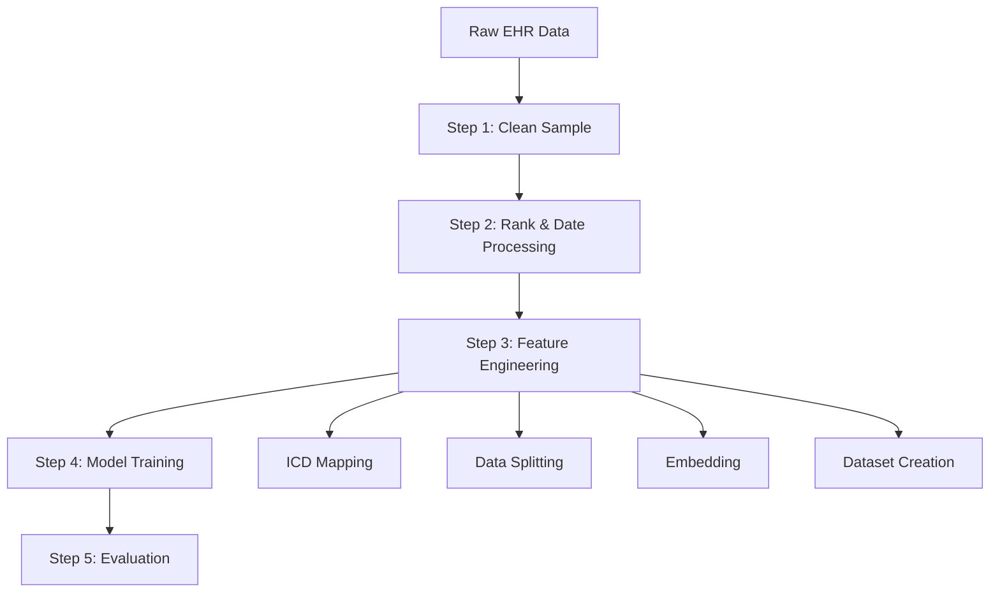

# 🏥 PaMCRP: Passive Multi-Cancer Risk Prediction

<div align="center">

[](https://www.python.org/downloads/)
[](https://pytorch.org/)
[](LICENSE)

*A deep learning framework for passive multi-cancer risk prediction using longitudinal Electronic Health Records*

</div>

## 📋 Overview

**PaMCRP** is an advanced pipeline that predicts cancer risk from longitudinal Electronic Health Records (EHR) data. It builds patient disease trajectories from ICD-10 codes and temporal features, then trains a transformer-based model with auxiliary demographic and behavioral features.

### 🎯 Key Features
- **Passive Prediction**: Utilizes existing EHR data without requiring dedicated screening tests
- **Multi-Cancer Approach**: Simultaneously predicts risk for 5 highest-incidence cancers
- **Synergistic Learning**: Captures both cancer-specific and shared risk patterns
- **Temporal Modeling**: Incorporates disease trajectory sequences with time intervals
- **Transformer Architecture**: Advanced deep learning with hierarchical embedding

### 🎯 Target Cancers
- **Lung** (C34)
- **Breast** (C50)
- **Colorectal** (C18-C20)
- **Prostate** (C61)
- **Stomach/Gastric** (C16)

---

## 🔧 System Requirements

### Hardware
- **OS**: Linux (Ubuntu 20.04/22.04), macOS, or Windows WSL2
- **CPU**: x86_64 architecture
- **RAM**: 16 GB recommended
- **GPU**: NVIDIA GPU with CUDA 11.x/12.x and ≥8 GB VRAM (optional but recommended)
- **Storage**: ~10 GB free space

### Software Dependencies
- **Python**: 3.9-3.11 (3.10 recommended)
- **PyTorch**: 2.0-2.3 with matching CUDA build
- **CUDA Toolkit**: 11.8 or 12.1 (if using GPU)
- **Core Libraries**: pandas≥1.5, numpy≥1.23, scikit-learn≥1.1, tqdm, matplotlib, gensim

---

## 🚀 Quick Start

### 1. Environment Setup

```bash
# Create conda environment
conda create -n pamcrp python=3.10 -y
conda activate pamcrp

# Install PyTorch (choose based on your setup)
# For CUDA 11.8
pip install torch torchvision torchaudio --index-url https://download.pytorch.org/whl/cu118

# For CPU-only
pip install torch torchvision torchaudio --index-url https://download.pytorch.org/whl/cpu

# Install dependencies
pip install pandas numpy scikit-learn tqdm matplotlib gensim
```

### 2. Data Preparation

Place your EHR data in the following structure:
```
../data/dataset.csv    # Main EHR table
../dataset/            # Output directory (auto-created)
../dataset/aux_data.csv # Optional auxiliary features
```

**Required columns in `dataset.csv`:**
- Participant ID
- Diagnoses - ICD10 (pipe-separated: `C50.9|I10|...`)
- Date of first in-patient diagnosis - ICD10 (YYYY/MM/DD format)
- Type of cancer: ICD10
- Date of cancer diagnosis (YYYY/MM/DD)
- Date of birth (YYYY/MM/DD)
- Sex, Age

### 3. Configuration

Edit `config.py` to customize:
- `gpu_id`: GPU index for CUDA
- `evaluation_times`: Time horizons in days
- `LEVEL`: ICD granularity level
- `Min_length`: Minimum diagnoses per patient
- `DIMS`: Embedding dimensions

### 4. Run the Pipeline

```bash
# Step 1-3: Preprocessing
python run.py

# Step 4: Train model
python step4_train.py

# Step 5: Evaluate model
python step5_test.py
```

---

## 📁 Repository Structure

```
PaMCRP/
├── 📄 config.py                 # Global configuration
├── 🚀 run.py                   # Orchestrates preprocessing (steps 1-3)
├── 🧹 step1_cleansample.py     # Build cohort subset
├── 📊 step2_rankdate.py        # Sort diagnoses, compute features
├── 🗺️ step3_1_icdmapping.py    # ICD-10 code utilities
├── 📑 step3_2_idx.py           # Train/val/test split
├── 🔗 step3_3_embedding.py     # Build patient feature tuples
├── 💾 step3_4_dataset.py       # Materialize datasets
├── 🎯 step4_train.py           # Model training
├── 🧪 step5_test.py            # Model evaluation
└── 📖 README.md                # This file
```

---

## 📊 Pipeline Workflow



---

## 📈 Outputs

### Generated Artifacts
- **`../dataset/`**: Preprocessed data, features, labels, and split indices
- **`./save/`**: Visualization plots (cancer distribution, etc.)
- **`../results/`**: Trained model checkpoints
- **`./result/my_results/`**: Evaluation metrics and results

### Key Files
- `step1_dataset_<TARGET>.csv`: Cleaned cohort data
- `best_model_<model_type>_<timestamp>.pth`: Best trained model
- `cancer_interval_distribution.png`: Data visualization plots

---

## 🛠️ Troubleshooting

### Common Issues

| Issue | Solution |
|-------|----------|
| Missing module errors | Ensure all required packages are installed and PYTHONPATH is set |
| Data column not found | Verify column names match exactly (case-sensitive) |
| CUDA errors | Install PyTorch with compatible CUDA version or use CPU build |
| Memory issues | Reduce batch size, sequence length, or filter smaller cohorts |

### Performance Tips
- **GPU Usage**: Enable CUDA for significant speedup during training
- **Memory Optimization**: Adjust batch size based on available GPU memory
- **Data Size**: Start with smaller cohorts for initial testing

---

## 📝 Notes

- **Date Format**: All dates should be in `YYYY/MM/DD` format
- **Reproducibility**: Uses `seed_torch(2023)` for consistent results
- **Ethnicity Mapping**: Coded values mapped to coarse groups (see `step3_3_embedding.py`)
- **GPU Selection**: Automatically selects CUDA if available

---

## 🤝 Contributing

We welcome contributions! Please feel free to submit issues and pull requests.

## 📄 License

This project is licensed under the MIT License - see the [LICENSE](LICENSE) file for details.

---

<div align="center">

**Built with ❤️ for advancing cancer risk prediction through AI**

</div>
